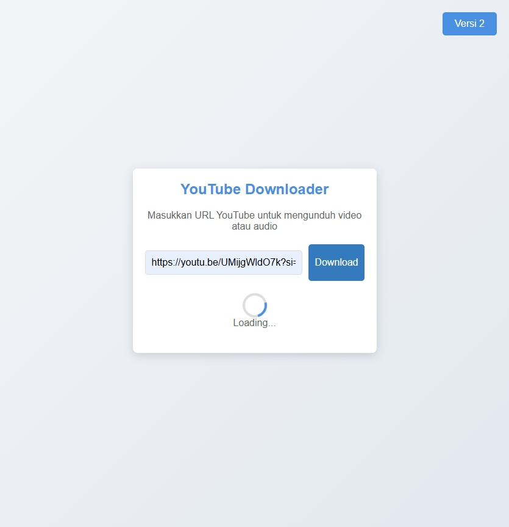
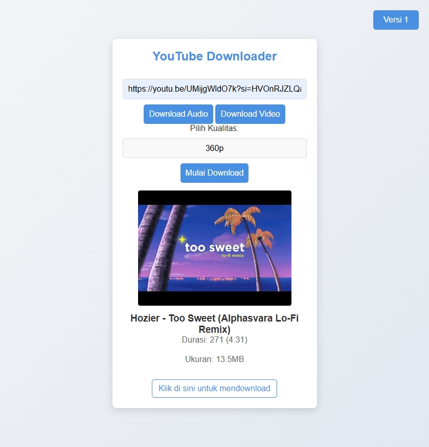

# YouTube Downloader

This project is a YouTube media downloader that allows users to download YouTube videos and audio in various qualities. It provides two versions of the interface: Version 1 and Version 2.

## Project Structure

## Installation

1. Clone the repository:

   ```sh
   git clone https://github.com/anshorfalahi/yt-unduh.git
   cd yt-unduh
   ```

2. Install the dependencies:
   ```sh
   npm install
   ```

## Usage

1. Start the server:

   ```sh
   npm start
   ```

2. Open your browser and navigate to `http://localhost:3000`.

## Endpoints

- `/api/download_v1`: Endpoint for downloading media using Version 1.
- `/api/download_v2`: Endpoint for downloading media using Version 2.

## Files

- `public/index_v1.html`: HTML file for Version 1 of the interface.
- `public/index_v2.html`: HTML file for Version 2 of the interface.
- `public/script.js`: Combined JavaScript file for both versions.
- `public/style.css`: Combined CSS file for both versions.
- `server.js`: Express server setup and API endpoints.

## Features

- **Version 1**:

  - Simple interface to input YouTube URL and download media.
  - Displays loading animation while fetching data.
  - Shows download links for available formats.

- **Version 2**:
  - Enhanced interface with options to select media type (audio/video) and quality.
  - Displays loading animation while fetching data.
  - Shows download links for available formats.

## Example

### Version 1



### Version 2



## License

This project is licensed under the ISC License.

## Author

Anshor Falahi - [@anshorfalahi](instagram.com/anshorfalahi)

```

```
